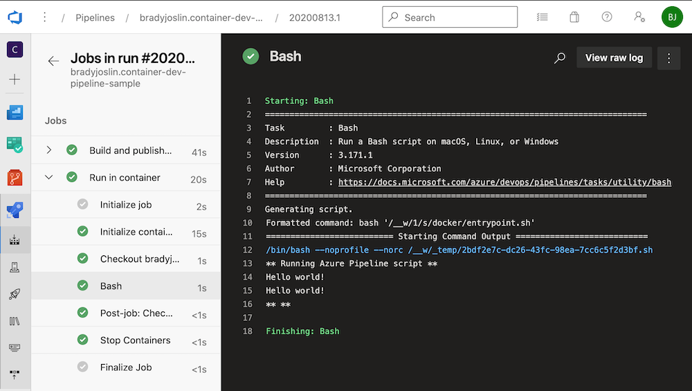

# container-dev-pipeline-sample

An example for how to share a single Dockerfile defined in a repository for both local development using VS Code dev containers and CI/CD with Azure Pipelines.

## VS Code Devcontainers

Dev containers provide a way to develop locally inside of a container whose definition is specified within the source code for your project, including any required dev dependencies and configurations.  This is a great way to create a shared, reproducible development environment for those working on a project.  This accelerates developer onboarding by removing the need for team members to install and configure dev dependencies for a project.  From the docs:

> The Visual Studio Code Remote - Containers extension lets you use a Docker container as a full-featured development environment. It allows you to open any folder inside (or mounted into) a container and take advantage of Visual Studio Code's full feature set. A devcontainer.json file in your project tells VS Code how to access (or create) a development container with a well-defined tool and runtime stack. This container can be used to run an application or to sandbox tools, libraries, or runtimes needed for working with a codebase. ([more](https://code.visualstudio.com/docs/remote/containers))

## Azure Pipeline Container Jobs

[Azure Pipeline Container Jobs](https://docs.microsoft.com/en-us/azure/devops/pipelines/process/container-phases?view=azure-devops) allow you to build and deploy your application from within a defined container instead of simply on the host the Pipeline agent is running on.  These provide a fantastic way to provide a consistent build environment that includes any needed dependencies and configurations for CI/CD or other types of automation.

## Unifying Dev and Build Containers

Using containers for developing and builds solve a lot of problems separately, but this still leaves teams open to the "it works on my machine" problem if different container definitions are used locally vs. for your builds.  However, through some simple configuration it is possible to use the same container definition for building with Azure Pipelines as you do for development with dev containers.  This POC project attempts to demonstrate one way of doing so.

### Example project structure

```
/container-dev-pipeline-sample
├── docker
  ├── Dockerfile        // Shared Docker configuration
  └── entrypoint.sh     // Script to be run inside the container running on Azure Pipelines
├── .devcontainer.json  // Configuration for the dev container that points to the Dockerfile
├── .gitignore
├── azure-pipelines.yml // Azure Pipeline configuration file
├── package.json        // Includes sample scripts that can be run locally and via Pipeline
├── package-lock.json
├── README.md
└── src                 // Contains sample content for testing
  ├── index.html
  └── index.json
```

### Using Local Dev Containers

Follow the [Getting Started Guide](https://code.visualstudio.com/docs/remote/containers#_getting-started) install the prerequisites on your development machine.  You can do this on macOS, Windows, or Linux.

To open this repo in a container:

1) Select `Remote-Containers: Open Repository in Container` from the VS Code Command Palette (F1)
1) When prompted for the repository to open enter `https://github.com/bradyjoslin/container-dev-pipeline-sample`
1) Select the first option to create a unique volume
1) VS Code should reload the window and start building the dev container

Once completed, you should see the source code for this project.  Open a terminal window in VS Code (Terminal -> New Terminal) to see a zsh command prompt running in the container using [starship.rs](https://starship.rs), which was included as a dependency in the Dockerfile.


Now run

```
npm run hello:cat --silent
```

This script runs `cat ./src/index.html`, so it should display `Hello World!` in your terminal.

Now try

```
npm run hello:rg --silent
```

This npm script runs `rg -i world! --iglob \*.html | awk 'NR==1' | cut -d ':' -f 2` and should also display `Hello World!` in your terminal - [ripgrep](https://github.com/BurntSushi/ripgrep), a command line search tool, was also included by your container configuration.

### Using Azure Pipeline

The Pipeline definition is set to run on pushes to any branch and defines two jobs.  

```yaml
trigger:
  - master
...
```

The first job builds and publishes a container based on the Dockerfile in the repo to an [Azure Container Registry] instance defined as a [Service Connection](https://docs.microsoft.com/en-us/azure/devops/pipelines/library/service-endpoints?view=azure-devops&tabs=yaml) in Azure DevOps named `PocAcr`.

```yaml
...
jobs:
  - job: BuildandPublishContainer
    displayName: Build and publish container

    pool:
      vmImage: "ubuntu-latest"

    steps:
      - task: Docker@2
        inputs:
          containerRegistry: "PocAcr"
          repository: "poc/dev"
          command: "buildAndPush"
          Dockerfile: "**/Dockerfile"
          tags: |
            $(Build.BuildNumber)
            latest
...
```

The second job is an Azure Container Job which pulls and runs the container published to the container registry in the previous step, running the entrypoint bash script within the container instance.

```yaml
...
  - job: RunInContainer
    displayName: Run in container
    dependsOn: BuildandPublishContainer

    pool:
      vmImage: "ubuntu-latest"

    container:
      image: bradyjoslinmyacr.azurecr.io/poc/dev:latest
      endpoint: "PocAcr"

    steps:
      - task: Bash@3
        inputs:
          filePath: "./docker/entrypoint.sh"
```

`entrypoint.sh` executes the two npm scripts we manual ran from within the devcontainer in VS Code earlier.

```yml
#!/bin/bash

set -e

echo "** Running Azure Pipeline script **"
npm run hello:rg --silent
npm run hello:cat --silent
echo "** **"
```

Note that `ripgrep` is not installed by the [ubuntu-latest hosted agent](https://github.com/actions/virtual-environments/blob/main/images/linux/Ubuntu2004-README.md) we are using in this Pipeline, so in order for our example script to work we need it to run in our defined container.


### TODO make the azure devops pipeline public

To see the Action run, simply fork and provide a PR to this repo with an innocuous change to this `README.md` file.  When the action is finished running you should see...

```text
** Running github action script **
Hello world!
Hello world!
** **
```

...under a new run of the Action under `CI/CD Automation` in `Automation step 1`.



🎉
